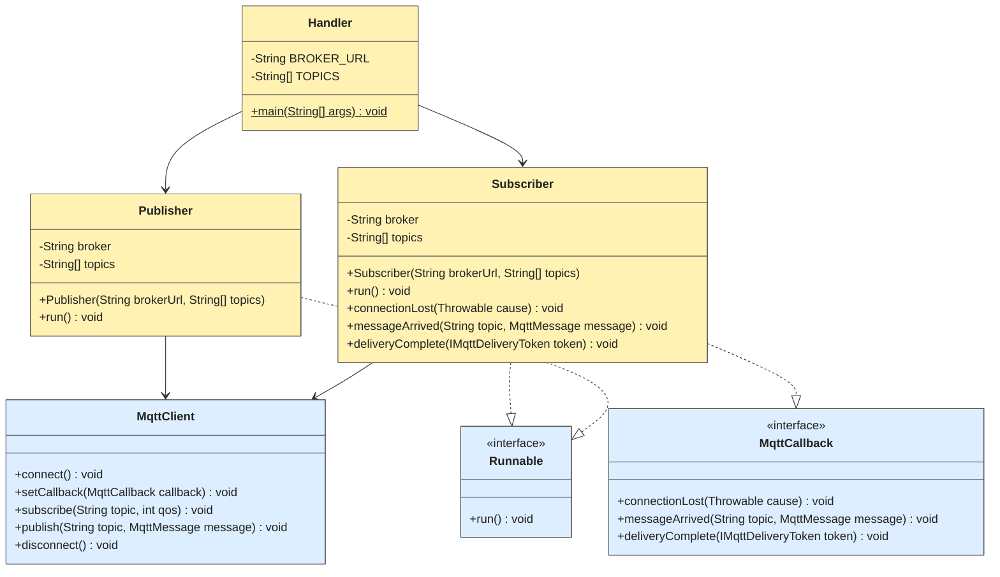

# UML Class Diagram

This diagram illustrates the MQTT application's classes, interfaces, attributes, methods, and relationships.

```mermaid
---
config:
  class:
    diagramPadding: 60
---
classDiagram
    direction TB

    class Handler {
        -String BROKER_URL
        -String[] TOPICS
        +main(String[] args)$ void
    }

    class Publisher {
        -String broker
        -String[] topics
        +Publisher(String brokerUrl, String[] topics)
        +run() void
    }

    class Subscriber {
        -String broker
        -String[] topics
        +Subscriber(String brokerUrl, String[] topics)
        +run() void
        +connectionLost(Throwable cause) void
        +messageArrived(String topic, MqttMessage message) void
        +deliveryComplete(IMqttDeliveryToken token) void
    }

    class Runnable {
        <<interface>>
        +run() void
    }

    class MqttCallback {
        <<interface>>
        +connectionLost(Throwable cause) void
        +messageArrived(String topic, MqttMessage message) void
        +deliveryComplete(IMqttDeliveryToken token) void
    }

    class MqttClient {
        +connect() void
        +setCallback(MqttCallback callback) void
        +subscribe(String topic, int qos) void
        +publish(String topic, MqttMessage message) void
        +disconnect() void
    }

    %% Associations
    Handler --> Publisher
    Handler --> Subscriber

    Publisher --> MqttClient
    Subscriber --> MqttClient

    %% Interface realizations
    Subscriber ..|> MqttCallback
    Subscriber ..|> Runnable
    Publisher ..|> Runnable


    %% CSC 3100 UML colors

    style Handler fill:#FFF2B3,stroke:#555555,color:#222222
    style Publisher fill:#FFF2B3,stroke:#555555,color:#222222
    style Subscriber fill:#FFF2B3,stroke:#555555,color:#222222

    style Runnable fill:#DCEEFF,stroke:#555555,color:#222222
    style MqttCallback fill:#DCEEFF,stroke:#555555,color:#222222
    style MqttClient fill:#DCEEFF,stroke:#555555,color:#222222
```
